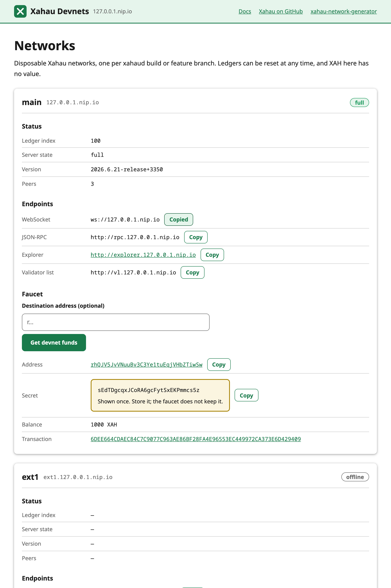

# xahau-network-generator

CLI that generates and runs disposable Xahau `testnet` (N validators) or
`standalone` networks for a given `xahaud` release, via Docker Compose.

## Usage

```sh
pnpm install
pnpm xng doctor   # docker, compose, build.xahau.tech reachable? optional features (proxy, TLS, Cloudflare) on/off

# create a network (downloads/caches the xahaud binary, derives amendments,
# generates keys/genesis/config into workspace/<name>/)
pnpm xng create --name t1 --type testnet --validators 3
pnpm xng create --name s1 --type standalone
# register a testnet that runs on another host (network.json only, nothing started)
pnpm xng create --name foo --external --domain xahau-dev.net --tls

# start it (docker compose up -d), optionally waiting for readiness
pnpm xng start --name t1 --wait

# stop / reset (wipe ledger data, restart from genesis) / remove
pnpm xng stop --name t1
pnpm xng reset --name t1 --wait
pnpm xng remove --name t1

# rolling upgrade of the xahaud binary on a running testnet, no downtime
pnpm xng upgrade --name t1 --version 2026.9.9-dev+3667

# make every validator vote for (or, with --reject, veto) an amendment
pnpm xng vote --name t1 --amendment fixSomething

# declare all networks in xng.yml and let xng work out the difference
pnpm xng apply --dry-run
pnpm xng apply
```

`reset` = stop, wipe ledger data, start again from genesis.

Every generated container is `restart: unless-stopped`, so after a host
reboot the network (and the shared Traefik) comes back on its own and each
node resumes from its last validated ledger (`--load`; standalone
`-a --load`), never from genesis — `xng reset` is the only thing that goes
back to genesis. `xng start`/`xng reset` re-render compose.yml, so networks
created before this existed pick it up on their next start. xahaud.cfg and
keys are generated at create time only, so a network created by an older xng
keeps its config; `xng remove` + `xng create` picks up config changes.

`upgrade` (testnet only) replaces the xahaud binary one node at a time —
`node` first, then each validator in order — waiting for each to rejoin
consensus on the new version before moving to the next, so the network is
never fully stopped. The default quorum is capped at `validators - 1` (see
below), so one validator can be mid-restart and consensus still keeps going;
pass `--quorum` yourself to raise it if you want stricter safety instead.

`vote` (testnet only) runs `feature <amendment> accept|reject` on each
validator. Every generated node sets `[amendment_majority_time]` to
1 minute (xahaud's floor), so an amendment with a majority is enabled at the
next flag ledger (every 256 ledgers) at least a minute later.

`--version` defaults to the latest release on build.xahau.tech. Binaries and
parsed amendment sources are cached under `~/.cache/xahau-network-generator`.
The testnet faucet's own key is generated per-network at `workspace/<name>/keys/faucet.json`.

### Networking

**testnet** networks publish nothing on a host port (not even the peer port —
xahaud's peer TLS sends no SNI, so it can't be proxied). Instead, `xng start`
and `xng reset` bring up a single shared Traefik instance (`xng proxy up` /
`xng proxy down` to manage it directly) that every testnet joins via the
external `proxy` Docker network, and routes each service by subdomain, e.g.
for a network named `t1`:

```
http://explorer.t1.127.0.0.1.nip.io
http://rpc.t1.127.0.0.1.nip.io
ws://t1.127.0.0.1.nip.io
http://faucet.t1.127.0.0.1.nip.io
ws://t1.127.0.0.1.nip.io/debugstream/<r-address>
```

The default domain, `127.0.0.1.nip.io`, resolves any subdomain to
`127.0.0.1` so this works out of the box on plain HTTP.

**Hook debug stream.** Every testnet's `node` logs hook `trace()` output,
SetHook validation, RPC replies and consensus metadata (xahaud's `View`,
`OpenLedger`, `LedgerConsensus`, `RPC`, `Server` and `NetworkOPs` partitions
at trace) to `workspace/<name>/nodes/node/log/debug.log`. The `debugstream`
service tails that file and streams it over WebSocket at
`ws(s)://<base>/debugstream/<r-address>` (every line mentioning that account,
what `wss://xahau-test.net/debugstream/<r-address>` sends) or `/debugstream/`
(the `Hook*` lines for every account). Messages are the raw log lines, and
anything a client sends is answered with the account, as on xahau-test.net.
Opening the same path in a browser (`http(s)://<base>/debugstream/<r-address>`)
shows a live viewer page, as on xahau-test.net. The file is only the hand-off between xahaud and the service: it keeps
no history and is truncated once it passes 10 MiB, so it never accumulates.
Every xahaud container's docker log is capped at 20 MB × 3 as well, since
xahaud writes the same lines to stderr. Standalone networks have no stream
service and write no log file; `node` still traces hooks to stderr, so
`docker logs -f <name>-node 2>&1 | grep HookTrace` does the same job there.
xahaud.cfg is written at create time, so a testnet created by an older xng
gets the stream service on its next start but no log to tail until it is
recreated.

### Serving several devnets on a real domain

One machine can serve any number of testnets under one domain, one per
feature branch, e.g. with `--domain xahau-dev.net`:

```
xng create --name jshooks --version 2026.9.8-jshooks+3640 --domain xahau-dev.net --tls
  -> wss://jshooks.xahau-dev.net, https://explorer.jshooks.xahau-dev.net, https://faucet.jshooks.xahau-dev.net, wss://jshooks.xahau-dev.net/debugstream/
xng create --name dev --root --version 2026.9.9-dev+3667 --domain xahau-dev.net --tls
  -> wss://xahau-dev.net, https://explorer.xahau-dev.net, https://faucet.xahau-dev.net, wss://xahau-dev.net/debugstream/
```

`--root` puts a network on the bare domain instead of `<name>.<domain>`;
only one root network per domain is allowed, and the names `explorer`,
`rpc`, `faucet`, `vl` are reserved so they can't shadow its subdomains.

**Landing page.** A root network also serves `https://<domain>/`: a page
listing every network on the domain with live status, endpoints and a
faucet. `wss://<domain>` stays on the same host (Traefik sends only
WebSocket upgrades to the node). The page is the repo's `site/` directory,
copied into the root network's `site/` on every `start`/`reset`, so edits
show up on the next start; the list of networks next to it
(`site/networks.json`) is rewritten on every `create`, `remove`, `start` and
`reset`, with no restart needed.



Two optional, cosmetic keys per network label it there: `displayName` (1-64
characters, the section heading) and `displayShortName` (1-24, the nav link and the
Faucet pill). Both default to the network name (`main` for the root network),
`displayShortName` to `displayName` first. They never recreate a network: change them
in `xng.yml` (`relabel`) or with `xng label --name <n> --display-name <text>
--display-short-name <text>` (an empty value clears one); `xng create` takes the same
two flags.

**`external: true`.** Devnets may run on several servers. Declare the ones
that run elsewhere in this server's `xng.yml` so they appear on its landing
page; only their hostnames are known here and nothing is started:

```yaml
networks:
  main:
    version: 2026.9.9-dev+3667
    domain: xahau-dev.net
    tls: true
    root: true
  foo:                       # runs on another server
    external: true
    domain: xahau-dev.net
    tls: true
```

Only `domain`, `tls`, `pwa`, `displayName` and `displayShortName` are allowed on an external network (it
cannot be `root`), and `start`/`stop`/`reset`/`upgrade`/`vote` refuse it.
DNS (`foo.<domain>` and `*.foo.<domain>` to the other server) and its certificate are yours to
arrange there.

Setup on the host — pick one of the two ways to get certificates:

**A. Let's Encrypt on the host (DNS-only records, ports 80/443 open)**

1. DNS: `A` records for `<domain>` and `*.<domain>` pointing at the machine.
   A DNS wildcard matches nested labels too, so
   `explorer.jshooks.<domain>` resolves. Keep these records DNS-only if the
   domain is on Cloudflare (proxying needs option B).
2. TLS: `pnpm xng proxy up --acme-email you@example.com` records the email
   in `traefik/acme.env` (gitignored) and from then on every `xng start`
   applies `traefik/compose.acme.yml`, so Traefik issues a Let's Encrypt
   certificate per hostname (HTTP-01 on port 80). Create networks with
   `--tls` so their advertised URLs are `https`/`wss`.

**B. Cloudflare only (Tunnel + Advanced Certificate Manager, no open ports)**

Cloudflare terminates TLS and a Cloudflare Tunnel carries the traffic to
Traefik, which only routes by hostname (no ACME). The free Universal
certificate covers `<domain>` and `*.<domain>` only, so each network's
nested hostnames need an [Advanced Certificate Manager](https://developers.cloudflare.com/ssl/edge-certificates/advanced-certificate-manager/)
certificate for `*.<name>.<domain>`. No CA issues `*.*.<domain>` and Total
TLS skips Tunnel hostnames, so this can't be done once up front: with
`XNG_CF_ZONE` set, `xng` orders that certificate through Cloudflare's
[`cf` CLI](https://github.com/cloudflare/cf) and waits for it to go active
on `xng create`, re-checks it (idempotently) on `xng start`/`xng reset`,
and deletes it on `xng remove`. Everything else is one-time setup:

1. Install and log in to `cf` (Node 22+): `npm i -g cf@0.15.0 && cf auth login`, or
   export `CLOUDFLARE_API_TOKEN` with *SSL and Certificates: Edit* on the
   zone. xng is verified against that cf release (`CF_VERSION` in
   `src/cloudflare.ts`); `xng doctor` warns when a different one is installed.
2. Create a remotely-managed tunnel and route everything to Traefik's
   published HTTP port (keep the panel rule, if any, before the wildcard):

   ```sh
   export CLOUDFLARE_ACCOUNT_ID=<account id>
   cf tunnels config update <tunnel-id> --body '{"config":{"ingress":[
     {"hostname":"xng.<domain>","service":"http://localhost:7777"},
     {"hostname":"<domain>","service":"http://localhost:80"},
     {"hostname":"*.<domain>","service":"http://localhost:80"},
     {"service":"http_status:404"}]}}'
   ```

   cloudflared's `*.<domain>` also matches nested hostnames
   (`explorer.jshooks.<domain>`), and it forwards the original `Host`
   header, which is what Traefik routes on.
3. DNS: proxied `CNAME` records for `<domain>` and `*` pointing at
   `<tunnel-id>.cfargotunnel.com` (the dashboard does not create the
   wildcard one for you):

   ```sh
   cf dns records create -z <domain> --body '{"type":"CNAME","name":"*","content":"<tunnel-id>.cfargotunnel.com","proxied":true}'
   cf dns records create -z <domain> --body '{"type":"CNAME","name":"<domain>","content":"<tunnel-id>.cfargotunnel.com","proxied":true}'
   ```

4. Run `cloudflared tunnel run --token <token>` on the host (e.g. as a
   systemd service), and export for `xng` (and `xng panel`):

   | variable | meaning |
   | --- | --- |
   | `XNG_CF_ZONE` | Cloudflare zone name, e.g. `xahau-dev.net`; enables this mode |
   | `XNG_CF_CA` | `google` (default), `lets_encrypt` or `ssl_com` |
   | `XNG_CF_CERT_TIMEOUT` | seconds `xng create` waits for the certificate (default 900) |
   | `XNG_CF_BIN` | path to `cf` (default `cf` on `PATH`) |

Create networks with `--tls`, and don't pass `--acme-email` in this mode.
A certificate takes a few minutes to become active (TXT validation is
automatic on a full-setup zone); `xng create` prints the URLs and then waits
for it. A root network on the zone apex needs no certificate of its own.
Non-Enterprise zones have a cap on advanced certificate packs; check
`cf ssl certificate-packs quota get -z <domain>` before running many networks.

`pnpm e2e:cf` verifies this setup: it orders and then deletes one certificate
pack for a throwaway network name (needs `XNG_CF_ZONE` and cf auth). CI runs
it when the `CLOUDFLARE_API_TOKEN` secret and `XNG_CF_ZONE` variable are set.

### Declarative networks: xng apply

`xng apply` makes `workspace/` match a file listing the networks you want,
like `terraform plan`/`apply`: it prints the difference, asks for
confirmation, then runs the matching `xng create|start|upgrade|remove`
commands as child processes.

```yaml
# xng.yml
networks:
  jshooks:                    # the key is the network name
    version: 2026.9.8-jshooks+3640   # required; "latest" is never resolved implicitly
    domain: xahau-dev.net
    tls: true
  main:
    version: 2026.9.9-dev+3667
    domain: xahau-dev.net
    tls: true
    root: true
  s1:
    type: standalone
    version: 2026.6.21-release+3350
    portOffset: 4000
```

[`xng.example.yml`](xng.example.yml) is a commented template listing every
key (`cp xng.example.yml xng.yml`).

The keys are those of `workspace/<name>/network.json`: `type` (default
`testnet`), `version`, `validators` (3), `quorum`, `networkId` (21339),
`domain` (`127.0.0.1.nip.io`), `tls` (false), `root` (false), `pwa` (false),
`external` (false), `portOffset` (0), `displayName`, `displayShortName`, `nodeConfig`, `validatorConfig`. `nodeConfig` (also `xng
create --node-config <json>`) adds or overrides `xahaud.cfg` sections of the
non-validating `node` only: a section xng already writes is replaced, any
other is appended; changing it recreates the network. `validatorConfig`
(`--validator-config <json>`) does the same for the testnet validators
v1..vN only, never `node`. `pwa` (`--pwa`) adds a xahaud `protocol = pwa`
port on `node`, routed at `pwa.<name>.<domain>`, with `secure_gateway` set
to the `proxy` Docker network's subnets so only Traefik can reach it (as
xahaud PR #793 requires); it needs a xahaud build containing that PR.
Defaults are the same as `xng create`; unknown keys are an error. The whole
file is validated (including `XNG_CF_ZONE` certificate hosts) before
anything runs. `networks: {}` is valid and means "remove everything".

```
xng apply [-f xng.yml] [-y] [--dry-run] [--timeout <sec>] [--network <name>]...
```

| flag | meaning |
| --- | --- |
| `-f, --file <path>` | desired networks (default `xng.yml`) |
| `-y, --yes` | do not ask `Apply? [y/N]` (required without a TTY) |
| `--dry-run` | print the plan and exit, touching nothing |
| `--timeout <sec>` | readiness timeout for each `start --wait` / `upgrade` (default 300) |
| `--network <name>` | plan only this network (repeatable); the rest are neither created nor removed |

| state | action | what runs |
| --- | --- | --- |
| only in the file | `create` | `create`, then `start --wait` |
| only in `workspace/` | `remove` | `remove` |
| testnet, only `version` differs | `upgrade` | (`start --wait` if stopped, then) `upgrade` |
| standalone `version`, or any other key differs | `recreate` | `remove`, `create`, `start --wait` (ledger data and keys are wiped) |
| identical but `displayName`/`displayShortName` | `relabel` | `label` (`start --wait` if stopped); no recreate |
| identical, any container not running | `start` | `start --wait` |
| identical, running, but `compose.yml` would render differently (xng updated) or a container runs an older image than the one pulled locally | `refresh` | `start --wait` (only the changed containers are recreated) |
| `external: true`, only in the file | `create` | `create --external` (no `start`) |
| `external: true`, identical | `unchanged` | nothing (containers are not looked at) |
| identical, every container running, and nothing to refresh | `unchanged` | nothing |

Before any step runs, `apply` downloads every `xahaud` version it is about
to create or upgrade to, so a mistyped version fails before anything is
removed. Removes run first, then creates, upgrades and starts, one step at a
time; the first failure stops the run. Running `apply` again recomputes from
the real state, so there is no rollback.

With `XNG_CF_ZONE` set, the plan also lists the Cloudflare certificate packs
that will be ordered (create, recreate) or deleted (remove, recreate); when it
is not set and a `tls` testnet is affected, the plan warns that no certificate
will be ordered or deleted.

Things to know:

- `unchanged` means every container is running, not that the network is ready: a
  network whose `start --wait` timed out is `unchanged` on the next run.
- `docker pull <image>` (e.g. the explorer's `xahau-devnet` tag) followed by
  `xng apply` rolls the new image out; `apply` never pulls by itself.
- `apply` owns all of `workspace/`: a network that is not in the file is
  removed, including ones made by hand with `xng create`. Read the plan.
- A directory under `workspace/` without a valid `network.json` (or whose
  `name` differs from the directory name) makes `apply` stop before doing
  anything; fix or remove it by hand.
- Do not run `xng panel` actions and `xng apply` at the same time.

### Web control panel

`pnpm xng panel` serves a small page (`src/panel.html`) that lists every
network with its state, validated ledger index, uptime and peers, and can
create, start/stop/reset, remove, upgrade and vote for amendments. Each
action runs the matching `xng` command as a child process, one at a time,
with its log shown in the page.

```sh
XNG_DOMAIN=xahau-dev.net XNG_TLS=1 \
XNG_ACCESS_TEAM=<team> XNG_ACCESS_AUD=<application audience tag> \
pnpm xng panel            # listens on 127.0.0.1:7777
```

Access control is Cloudflare Access: put the panel behind a
[cloudflared tunnel](https://developers.cloudflare.com/cloudflare-one/connections/connect-networks/)
(`ingress: hostname: xng.<domain>, service: http://localhost:7777`) with an
Access application on that hostname, and pass the team name and the
application's audience (AUD) tag. The panel verifies the
`Cf-Access-Jwt-Assertion` token Cloudflare adds to every request, so it is
unusable without a valid login even if something else reaches the port. It
refuses to start without both values unless given `--insecure-no-auth`,
which serves loopback clients only (local development).

Run it as a service from the repo root, e.g. a systemd unit with
`WorkingDirectory=/path/to/xahau-network-generator`,
`ExecStart=/usr/bin/pnpm xng panel` and the environment above.

Container-to-container references (xahaud's peer list, the validator list
URL, the faucet's websocket URL) use container names (`<name>-<service>`,
e.g. `t1-node`) rather than bare service names (`node`) — since every
testnet's services join the same shared `proxy` network, a bare service name
would be ambiguous between testnets running side by side.

**standalone** networks are unaffected by Traefik: they publish their ports
directly on the host, bound to `127.0.0.1` only since the admin ports trust
every client (rpc admin 5005, rpc public 5007, ws admin 6006, ws public 6008,
peer 51235, explorer 4000). `--port-offset N` shifts every one of those ports
so several standalone networks can run side by side.

## Development

```sh
pnpm lint     # biome check
pnpm format   # biome format --write
pnpm test     # node:test over src/**/*.test.ts
pnpm e2e      # end-to-end check against a running network
pnpm e2e:restart --name t1 -- <reboot-simulating command>  # e.g. CI uses `sudo systemctl restart docker`
pnpm e2e:apply --version <ver> --upgrade-to <ver>  # xng apply end to end; needs an empty workspace/ (aborts otherwise)
```
